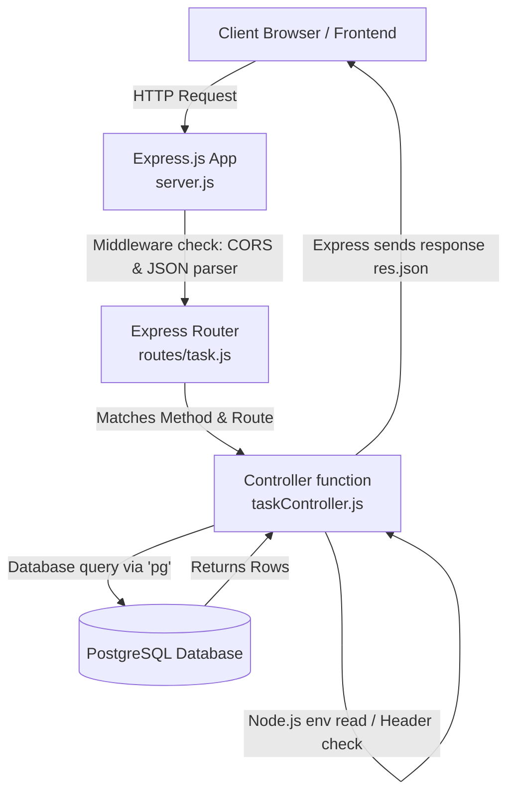

# Learning Node.js & Express.js: Task Manager Backend Explainer

Welcome to Node.js and Express.js! This guide is designed specifically for someone new to backend development in JavaScript. It explains how your task manager backend works, breaks down what **Node.js** and **Express.js** do, and walks through your source code line-by-line to show who does what.

---

## 1. What is Node.js vs. Express.js?

To understand how they work together, consider this physical analogy:

*   **Node.js is the Engine**: It is the raw power source. It reads the code, manages files, talks to the database, reads environments, and runs Javascript outside of a web browser.
*   **Express.js is the Dashboard & Steering Wheel**: It is a framework built *on top* of Node.js. It simplifies building a web server by providing tools to listen for HTTP requests (like `GET` or `POST`), route them to specific functions, and send back responses.

### Key Concepts Comparison

| Concept | Node.js (The Runtime Environment) | Express.js (The Web Framework) |
| :--- | :--- | :--- |
| **What is it?** | A runtime environment that lets you execute JavaScript directly on your computer (server-side). | A minimalist framework built *for* Node.js to handle HTTP requests/responses and routing. |
| **Core Job** | Interacting with the operating system, system files, network adapters, and environment variables. | Directing web traffic (URLs) to functions and returning JSON or HTML back to the browser. |
| **Common Syntax** | `require()`, `module.exports`, `process.env`, `console.log` | `express()`, `app.use()`, `router.get()`, `req.body`, `res.json()` |
| **Example Utility** | Connecting to a PostgreSQL database using TCP sockets. | Creating an endpoint like `/api/task` for users to save new tasks. |

---

## 2. Project Architecture & Request Flow

Here is how a client request (e.g. from your React/Vite frontend or a test client) travels through your backend:



---

## 3. Detailed Line-by-Line Breakdown of Your Code

Let's dissect each file to see what Node.js is doing and what Express.js is doing.

### File 1: [server.js](file:///Users/farhadmahmud/Desktop/task-manager-app/backend/src/server.js)
This is the entry point of your server. It sets up the server, attaches middleware, and defines what ports to listen on.

```javascript
const express = require('express'); // 1
const cors = require('cors');       // 2
require('dotenv').config();         // 3

const tasksRouter = require('./routes/task'); // 4

const app = express(); // 5

app.use(cors());          // 6
app.use(express.json());  // 7

app.use('/api/task', tasksRouter); // 8

const PORT = process.env.PORT || 5050; // 9

app.listen(PORT, () => { // 10
  console.log(`Server running on http://localhost:${PORT}`); // 11
});
```

#### Line-by-Line Explanation:
1.  **Line 1 (`require('express')`)**: 
    *   **Responsible**: **Node.js**
    *   **Explanation**: Node.js uses `require()` (CommonJS module system) to load external libraries installed in your `node_modules`. Here, it imports the Express framework.
2.  **Line 2 (`require('cors')`)**: 
    *   **Responsible**: **Node.js**
    *   **Explanation**: Node.js imports the third-party `cors` (Cross-Origin Resource Sharing) library so your frontend (on a different port) is allowed to make requests to the backend.
3.  **Line 3 (`require('dotenv').config()`)**: 
    *   **Responsible**: **Node.js**
    *   **Explanation**: Imports the `dotenv` library. It reads your `.env` file and loads its variables into Node's global `process.env` object.
4.  **Line 4 (`require('./routes/task')`)**: 
    *   **Responsible**: **Node.js**
    *   **Explanation**: Node.js imports your local routes configuration file from the filesystem.
5.  **Line 5 (`const app = express()`)**: 
    *   **Responsible**: **Express.js**
    *   **Explanation**: Creates an Express application object. Think of `app` as your virtual server manager.
6.  **Line 6 (`app.use(cors())`)**: 
    *   **Responsible**: **Express.js**
    *   **Explanation**: `app.use()` is an Express function that registers "middleware". This middleware runs CORS checks on every incoming request.
7.  **Line 7 (`app.use(express.json())`)**: 
    *   **Responsible**: **Express.js**
    *   **Explanation**: Registers a built-in Express middleware that parses incoming request bodies formatted as JSON. It takes the raw string body and turns it into a JavaScript object readable in `req.body`.
8.  **Line 8 (`app.use('/api/task', tasksRouter)`)**: 
    *   **Responsible**: **Express.js**
    *   **Explanation**: Directs any HTTP requests starting with `/api/task` to be handled by the `tasksRouter`.
9.  **Line 9 (`process.env.PORT`)**: 
    *   **Responsible**: **Node.js**
    *   **Explanation**: Accesses Node's environmental variables via the global `process` object.
10. **Line 10 (`app.listen(...)`)**: 
    *   **Responsible**: **Express.js / Node.js**
    *   **Explanation**: `app.listen` is an Express helper. Under the hood, it instructs Node's networking module to open a TCP port (`PORT`) and wait for incoming web connections.
11. **Line 11 (`console.log(...)`)**: 
    *   **Responsible**: **Node.js**
    *   **Explanation**: In browsers, `console.log` writes to the developer console. In Node.js, it writes directly to your terminal screen.

---

### File 2: [routes/task.js](file:///Users/farhadmahmud/Desktop/task-manager-app/backend/src/routes/task.js)
This file maps different URL pathways and HTTP methods (`GET`, `POST`, `PATCH`, `DELETE`) to the controller functions.

```javascript
const express = require('express'); // 1
const router = express.Router();    // 2
const {
  getAllTasks,
  createTask,
  updateTaskStatus,
  deleteTask,
} = require('../controllers/taskController'); // 3

router.get('/', getAllTasks);          // 4
router.post('/', createTask);          // 5
router.patch('/:id', updateTaskStatus); // 6
router.delete('/:id', deleteTask);      // 7

module.exports = router; // 8
```

#### Line-by-Line Explanation:
1.  **Line 1 (`require('express')`)**: 
    *   **Responsible**: **Node.js**
    *   **Explanation**: Imports the Express module.
2.  **Line 2 (`express.Router()`)**: 
    *   **Responsible**: **Express.js**
    *   **Explanation**: Instantiates a mini-router object. This lets you modularize your routes into different files instead of writing everything inside `server.js`.
3.  **Line 3 (`require(...)`)**: 
    *   **Responsible**: **Node.js**
    *   **Explanation**: Imports the controller functions from `taskController.js` using destructuring syntax.
4.  **Line 4 (`router.get('/', getAllTasks)`)**: 
    *   **Responsible**: **Express.js**
    *   **Explanation**: Tells Express that when a client triggers an HTTP `GET` request to the base URL (`/`), it should invoke the `getAllTasks` function.
5.  **Line 5 (`router.post('/', ... )`)**: 
    *   **Responsible**: **Express.js**
    *   **Explanation**: Links the HTTP `POST` method to the `createTask` function (used for creating new tasks).
6.  **Line 6 (`router.patch('/:id', ... )`)**: 
    *   **Responsible**: **Express.js**
    *   **Explanation**: Links HTTP `PATCH` requests to `updateTaskStatus`. The `/:id` represents a wild-card/variable parameter (e.g. `/api/task/42` where 42 is the task ID).
7.  **Line 7 (`router.delete('/:id', ... )`)**: 
    *   **Responsible**: **Express.js**
    *   **Explanation**: Links HTTP `DELETE` requests for a specific task ID to the `deleteTask` handler.
8.  **Line 8 (`module.exports = router`)**: 
    *   **Responsible**: **Node.js**
    *   **Explanation**: CommonJS syntax that exports the configured `router` object so other files (like `server.js`) can import it.

---

### File 3: [controllers/taskController.js](file:///Users/farhadmahmud/Desktop/task-manager-app/backend/src/controllers/taskController.js)
This file houses the actual business logic of the app. It takes the requests, extracts parameters, writes/reads database data, and returns the response.

> [!NOTE]
> Every controller function accepts two critical parameters: `req` (the Request object, representing incoming data) and `res` (the Response object, used to send data back). Both `req` and `res` are created and managed by **Express.js**.

Let's dissect the `createTask` function as our primary example:

```javascript
const pool = require('../db'); // 1

const createTask = async (req, res) => { // 2
  const sessionId = req.headers['x-session-id']; // 3
  if (!sessionId) {
    return res.status(400).json({ error: 'X-Session-ID header is required' }); // 4
  }

  const { title, description, status } = req.body; // 5

  if (!title) {
    return res.status(400).json({ error: 'title is required' }); // 6
  }

  try {
    const result = await pool.query( // 7
      `INSERT INTO tasks (title, description, status, session_id) 
       VALUES ($1, $2, COALESCE($3, 'To Do')::task_status, $4) 
       RETURNING *`,
      [title, description, status, sessionId]
    );
    res.status(201).json(result.rows[0]); // 8
  } catch (err) {
    console.error(err); // 9
    res.status(500).json({ error: 'failed to create task' }); // 10
  }
};
```

#### Line-by-Line Explanation:
1.  **Line 1 (`require('../db')`)**: 
    *   **Responsible**: **Node.js**
    *   **Explanation**: Node.js imports the custom database pool configuration file from your project structure.
2.  **Line 2 (`async (req, res) => { ... }`)**:
    *   **Responsible**: **General JavaScript / Express.js**
    *   **Explanation**: An asynchronous function definition. The parameters `req` and `res` are injected by the Express router when an HTTP request matching this route arrives.
3.  **Line 3 (`req.headers['x-session-id']`)**:
    *   **Responsible**: **Express.js**
    *   **Explanation**: Express parses raw HTTP headers into an easy-to-use object. This line retrieves the `X-Session-ID` header value.
4.  **Line 4 (`res.status(400).json(...)`)**:
    *   **Responsible**: **Express.js**
    *   **Explanation**: Express-specific methods. `res.status(400)` sets the HTTP response status code to 400 (Bad Request). `.json(...)` formats the JavaScript object as a JSON string, sets the correct `Content-Type: application/json` HTTP header, and sends it back to the client.
5.  **Line 5 (`req.body`)**:
    *   **Responsible**: **Express.js**
    *   **Explanation**: Express populated this object automatically on Line 7 of `server.js` using the `express.json()` middleware. This line extracts JSON body properties sent by the user (`title`, `description`, `status`).
6.  **Line 6 (`res.status(400).json(...)`)**:
    *   **Responsible**: **Express.js**
    *   **Explanation**: Sends back an error response if the user omitted a title.
7.  **Line 7 (`pool.query(...)`)**:
    *   **Responsible**: **Node.js / Third-Party Library (pg)**
    *   **Explanation**: This is database execution logic. While written in JavaScript, Node.js manages the network sockets underneath. The `pg` library runs a parameterized SQL query safely to prevent SQL injection.
8.  **Line 8 (`res.status(201).json(...)`)**:
    *   **Responsible**: **Express.js**
    *   **Explanation**: Returns a status of 201 (Created) and sends the saved row data back to the browser.
9.  **Line 9 (`console.error(err)`)**:
    *   **Responsible**: **Node.js**
    *   **Explanation**: Outputs the query stack trace directly to the terminal stdout for debugging.
10. **Line 10 (`res.status(500)...`)**:
    *   **Responsible**: **Express.js**
    *   **Explanation**: Returns a status of 500 (Internal Server Error) if the database query fails.

---

### File 4: [db.js](file:///Users/farhadmahmud/Desktop/task-manager-app/backend/src/db.js)
This file establishes connectivity with the PostgreSQL database.

```javascript
console.log('DATABASE_URL is:', process.env.DATABASE_URL ? 'SET' : 'MISSING'); // 1
const { Pool } = require('pg'); // 2

require('dotenv').config(); // 3

const pool = new Pool({ // 4
  connectionString: process.env.DATABASE_URL,
  ssl: { rejectUnauthorized: false },
});

pool.on('connect', () => { // 5
  console.log('Connected to PostgreSQL database');
});

pool.on('error', (err) => { // 6
  console.error('Unexpected error on idle client', err);
});

module.exports = pool; // 7
```

#### Line-by-Line Explanation:
1.  **Line 1 (`console.log`, `process.env`)**:
    *   **Responsible**: **Node.js**
    *   **Explanation**: Evaluates whether the environment variable `DATABASE_URL` exists and outputs it to the server console log.
2.  **Line 2 (`require('pg')`)**:
    *   **Responsible**: **Node.js**
    *   **Explanation**: Imports the `pg` (PostgreSQL Client) Node module.
3.  **Line 3 (`require('dotenv').config()`)**:
    *   **Responsible**: **Node.js**
    *   **Explanation**: Re-verifies environment variables are initialized (safe precaution).
4.  **Line 4 (`new Pool(...)`)**:
    *   **Responsible**: **Database Library**
    *   **Explanation**: Creates a database connections pool using standard connection parameters. Under the hood, Node.js networking modules manage the database socket connections.
5.  **Lines 5 & 6 (`pool.on(...)`)**:
    *   **Responsible**: **Node.js Event System**
    *   **Explanation**: Event handlers. Node.js is an event-driven runtime. It registers functions to run whenever specific events (`'connect'`, `'error'`) are fired by the database pool.
6.  **Line 7 (`module.exports = pool`)**:
    *   **Responsible**: **Node.js**
    *   **Explanation**: Exports the configured connection pool module.

---

## 4. Summary Cheat Sheet for Beginners

When you look at future projects, use this cheat sheet to distinguish between the two:

*   **If you see files being imported using `require()` or `module.exports`**: You are looking at Node.js module loading.
*   **If you see port, server setup, or server initialization (`app.listen()`, `app.use()`)**: You are looking at Express.js setting up the HTTP server layer.
*   **If you see endpoint logic, URL patterns, or parameters (`/:id`, `req.params`, `req.body`, `res.status()`, `res.json()`)**: You are looking at Express.js processing a web request and designing the API response.
*   **If you see console output (`console.log`), environment lookups (`process.env`), file reading (`fs`), or system configurations**: You are looking at Node.js interacting directly with the computer system environment.
